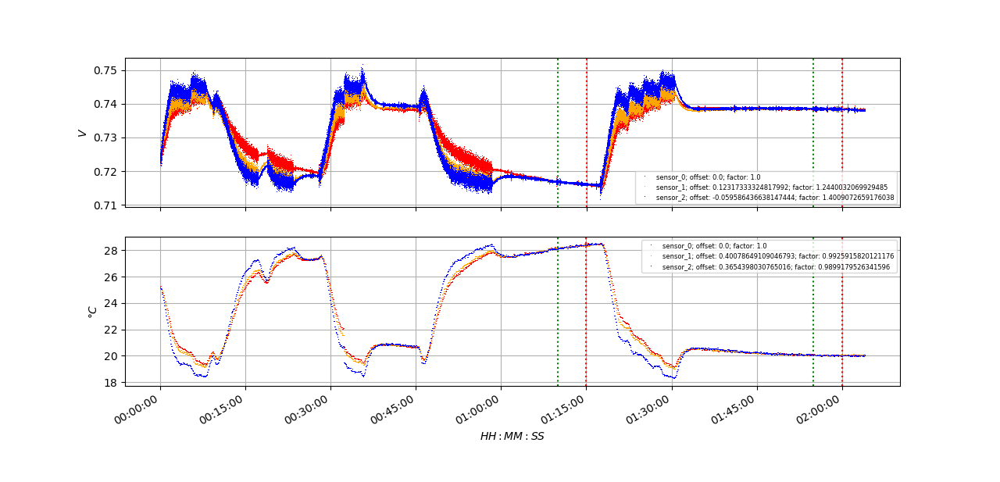
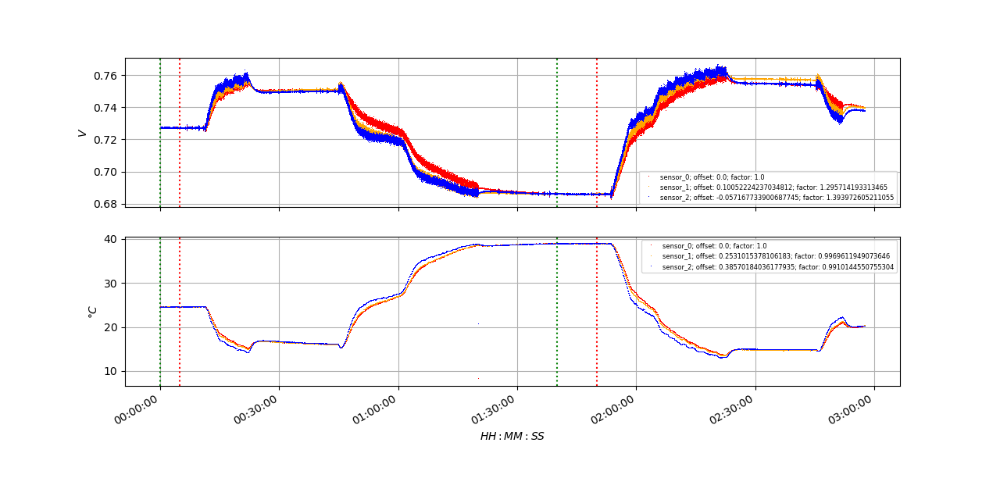
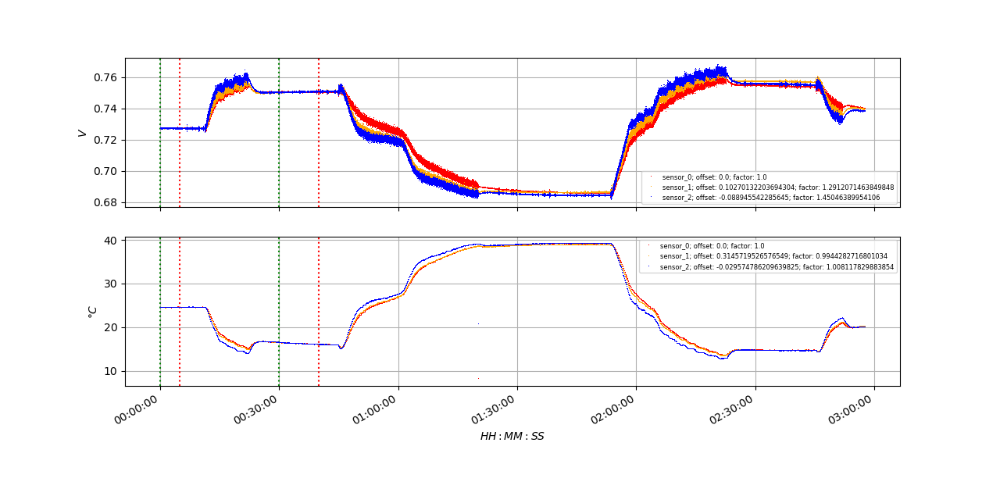
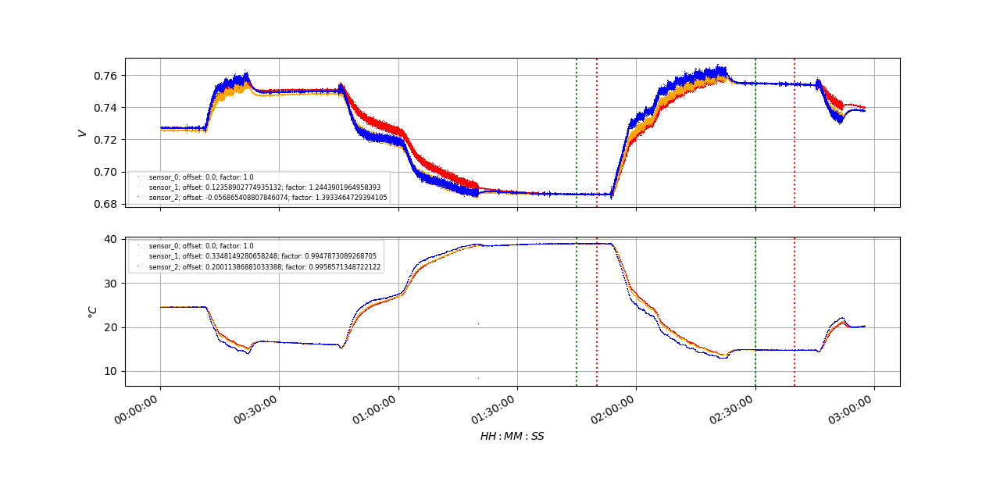

# Commands
usage: plot.py [-h] [-p {default,mean,time}] [-c marker_1_start marker_1_stop marker_2_start marker_2_stop] [-f] [-s start stop] file
               [-s--slice SLICE SLICE]
               file
``` bash
plot.py outputs/out_2020-09-23_16-25-26_0.mat -c 1:10:0 1:15:0 1:55:0 2:0:0 -f
```

``` bash
plot.py outputs/out_2020-09-24_13-05-04_0.mat -c 0:0:0 0:5:0 1:40:0 1:50:0 -f
```

``` bash
plot.py outputs/out_2020-09-24_13-05-04_0.mat -c 0:0:0 0:5:0 0:30:0 0:40:0 -f
```

``` bash
plot.py outputs/out_2020-09-24_13-05-04_0.mat -c 1:45:0 1:50:0 2:30:0 2:40:0 -f
```


``` bash
plot.py outputs/out_2020-09-24_11-24-10_0.mat -f
```
